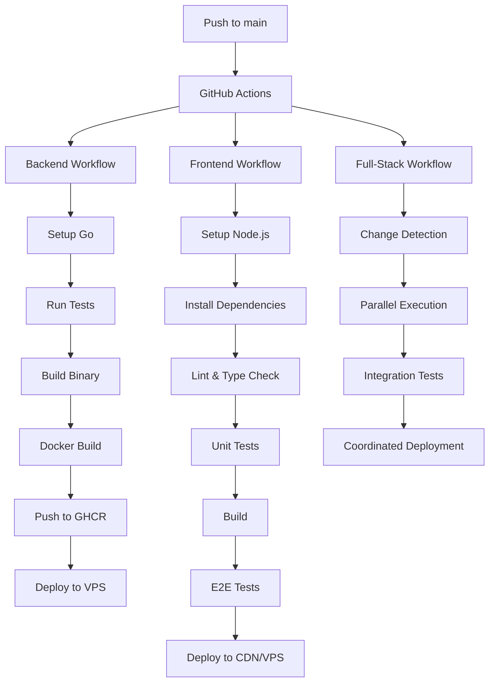

# Phase 12 — CI/CD (GitHub Actions) ✅

This phase implements comprehensive CI/CD automation using GitHub Actions for the Go-Vue BlogCMS project.

## Overview

The CI/CD pipeline provides automated build, test, and deployment workflows that trigger on pushes to the main branch, ensuring code quality and seamless deployments.

## Architecture



## Implementation

### 1. Backend CI/CD Workflow (`.github/workflows/backend.yml`)

**Features:**
- Go environment setup with matrix builds (1.21, 1.22)
- MySQL service container for testing
- Comprehensive test suite execution
- Docker multi-stage builds
- GitHub Container Registry (GHCR) integration
- VPS deployment via SSH
- Health checks and rollback capabilities

**Workflow Steps:**
1. **Test Phase**: Unit tests, integration tests with real database
2. **Build Phase**: Go binary compilation with optimization
3. **Docker Phase**: Multi-stage container build and push to GHCR
4. **Deploy Phase**: SSH deployment to VPS with health checks

### 2. Frontend CI/CD Workflow (`.github/workflows/frontend.yml`)

**Features:**
- Node.js environment setup
- TypeScript type checking and ESLint
- Unit and component testing with Jest/Vitest
- E2E testing with Playwright
- Dual deployment strategy (CDN + VPS)
- Build artifact management

**Workflow Steps:**
1. **Quality Phase**: Linting, type checking, unit tests
2. **Build Phase**: Production build with optimization
3. **E2E Phase**: End-to-end testing with backend integration
4. **Deploy Phase**: S3/CloudFront deployment + VPS static files

### 3. Full-Stack Orchestration (`.github/workflows/ci-cd.yml`)

**Features:**
- Intelligent change detection
- Parallel workflow execution
- Coordinated deployment
- Cross-service health checks
- Notification system

**Workflow Steps:**
1. **Detection Phase**: Analyze changed files (backend/, frontend/, workflows/)
2. **Parallel Phase**: Run relevant workflows simultaneously
3. **Integration Phase**: Cross-service testing
4. **Deployment Phase**: Coordinated multi-service deployment

## Infrastructure

### 1. Docker Configuration (`docker-compose.yml`)

**Services:**
- **Backend**: Go application with health checks
- **Database**: MySQL with persistence and initialization
- **Cache**: Redis for session and data caching
- **Proxy**: Nginx reverse proxy with static file serving

**Features:**
- Multi-environment support
- Volume persistence
- Network isolation
- Health monitoring
- Resource limits

### 2. Nginx Configuration (`nginx/`)

**Configuration:**
- Reverse proxy to backend API
- Static file serving for frontend
- Rate limiting and security headers
- SSL/TLS configuration
- Cache optimization

**Security Features:**
- Request rate limiting
- Security headers (XSS, HSTS, etc.)
- File access restrictions
- CORS configuration

### 3. Deployment Automation (`scripts/deploy.sh`)

**Features:**
- Automated deployment process
- Database backup before deployment
- Health check validation
- Rollback capabilities
- Resource cleanup

**Operations:**
- `deploy`: Full deployment with backup/rollback
- `rollback`: Restore previous version
- `health`: Perform health checks
- `logs`: View service logs
- `cleanup`: Remove old resources

## Configuration

### 1. GitHub Secrets

Required secrets for CI/CD pipeline:

```bash
# Database Configuration
DB_HOST=your-database-host
DB_USER=blogcms_user
DB_PASSWORD=your-secure-password
DB_NAME=blogcms_db

# Application Secrets
JWT_SECRET=your-jwt-secret

# VPS Deployment
VPS_HOST=your-vps-ip
VPS_USER=deploy
VPS_SSH_KEY=your-ssh-private-key

# CDN Deployment (Optional)
AWS_ACCESS_KEY_ID=your-aws-key
AWS_SECRET_ACCESS_KEY=your-aws-secret
S3_BUCKET=your-s3-bucket
CLOUDFRONT_DISTRIBUTION_ID=your-distribution-id
```

### 2. Environment Variables

Production environment configuration:

```bash
# Application
GIN_MODE=release
PORT=8080
CORS_ORIGINS=https://yourdomain.com

# Security
JWT_SECRET=${JWT_SECRET}
UPLOAD_MAX_SIZE=10485760

# Services
REDIS_HOST=redis
REDIS_PORT=6379
```

## Deployment Process

### 1. Automatic Deployment

```bash
# Push to main branch triggers full pipeline
git push origin main
```

**Pipeline Flow:**
1. Code pushed to main branch
2. GitHub Actions detect changes
3. Run appropriate workflows (backend/frontend/both)
4. Execute tests and build processes
5. Deploy to staging environment
6. Run integration tests
7. Deploy to production
8. Perform health checks
9. Send notifications

### 2. Manual Deployment

```bash
# SSH to VPS
ssh deploy@your-vps-host

# Navigate to deployment directory
cd /opt/blogcms

# Run deployment script
./scripts/deploy.sh deploy
```

### 3. Rollback Process

```bash
# Automatic rollback on health check failure
# Or manual rollback
./scripts/deploy.sh rollback
```

## Monitoring & Observability

### 1. Health Checks

**Endpoints:**
- `/health`: Application health status
- `/api/v1/health`: API-specific health
- Database connectivity check
- Redis connectivity check

### 2. Logging

**Log Aggregation:**
- Structured JSON logging
- Container log collection
- Centralized log management
- Error tracking and alerts

### 3. Metrics

**Performance Monitoring:**
- Response time tracking
- Error rate monitoring
- Resource utilization
- Database performance

## Security

### 1. Pipeline Security

**Measures:**
- Secret management with GitHub Secrets
- SSH key-based authentication
- Container image scanning
- Dependency vulnerability checks

### 2. Infrastructure Security

**Configuration:**
- Firewall rules and port restrictions
- SSL/TLS encryption
- Rate limiting and DDoS protection
- Regular security updates

### 3. Application Security

**Features:**
- JWT-based authentication
- CORS policy enforcement
- Input validation and sanitization
- File upload restrictions

## Testing Strategy

### 1. Backend Testing

**Test Types:**
- Unit tests with testify
- Integration tests with testcontainers
- API endpoint testing
- Database integration testing

**Coverage:**
- Models and business logic
- API handlers and middleware
- Database operations
- Authentication and authorization

### 2. Frontend Testing

**Test Types:**
- Unit tests with Jest/Vitest
- Component testing with Testing Library
- E2E testing with Playwright
- Visual regression testing

**Coverage:**
- Component functionality
- User interactions
- API integration
- Routing and navigation

### 3. Integration Testing

**Scenarios:**
- Full-stack API workflows
- Authentication flows
- File upload/download
- Error handling

## Performance Optimization

### 1. Build Optimization

**Backend:**
- Multi-stage Docker builds
- Binary optimization flags
- Dependency layer caching

**Frontend:**
- Code splitting and lazy loading
- Asset optimization and compression
- Tree shaking and minification

### 2. Runtime Optimization

**Caching:**
- Redis for session data
- HTTP caching headers
- CDN edge caching

**Database:**
- Connection pooling
- Query optimization
- Index strategy

## Disaster Recovery

### 1. Backup Strategy

**Automated Backups:**
- Database backups before deployment
- Configuration file backups
- Container image versioning

### 2. Recovery Procedures

**Rollback Process:**
- Automatic rollback on health check failure
- Manual rollback with single command
- Database restoration from backup

### 3. High Availability

**Redundancy:**
- Multi-instance deployment capability
- Load balancer configuration
- Database replication setup

## Documentation

### 1. Setup Guides

- **[SECRETS.md](docs/SECRETS.md)**: Complete guide for configuring GitHub secrets
- **[DEPLOYMENT.md](docs/DEPLOYMENT.md)**: Comprehensive deployment documentation

### 2. Operational Guides

- Health check procedures
- Troubleshooting guides
- Performance tuning
- Security best practices

## Success Criteria ✅

### ✅ Backend Workflow
- [x] Automated Go setup and testing
- [x] Docker build and push to GHCR
- [x] VPS deployment via SSH
- [x] Health checks and rollback

### ✅ Frontend Workflow
- [x] Node.js setup and testing
- [x] Build and optimization
- [x] E2E testing integration
- [x] CDN and VPS deployment

### ✅ Infrastructure
- [x] Docker compose orchestration
- [x] Nginx reverse proxy
- [x] Database and Redis services
- [x] SSL/TLS configuration

### ✅ Automation
- [x] Push to main triggers pipeline
- [x] Automated testing and deployment
- [x] Health checks and monitoring
- [x] Rollback capabilities

### ✅ Security
- [x] Secret management
- [x] SSH-based deployment
- [x] Rate limiting and headers
- [x] Container security

### ✅ Documentation
- [x] Complete setup guides
- [x] Deployment procedures
- [x] Troubleshooting documentation
- [x] Security configuration

## Next Steps

With Phase 12 complete, the project now has:

1. **Production-Ready CI/CD**: Automated pipelines for build, test, and deployment
2. **Infrastructure as Code**: Docker-based deployment with orchestration
3. **Security Implementation**: Comprehensive security measures and secret management
4. **Monitoring & Observability**: Health checks, logging, and performance monitoring
5. **Documentation**: Complete guides for setup, deployment, and operations

The application is now ready for production deployment with enterprise-grade CI/CD automation!
